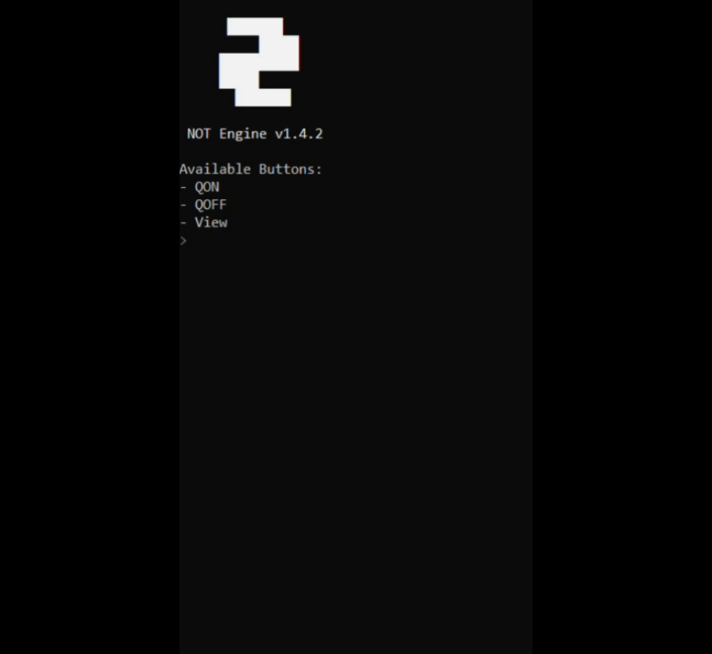

<div align="center">
  
  
  # NOT Engine
 **Logic gates as a scripting language**
</div>

<br>

**NOT**(NotEngine) is a declarative, logic-based domain-specific language (DSL) designed for simulating digital circuits and asynchronous signal processing. It uses a line-based syntax to define logic gates and their interconnections.


### Getting Started
- Download NOT_Engine.dll and NOT_Enhost.exe, or compile from git repository
- Create any .not file
- Open it in any text editor
- Write down your script
- Drag n drop it on enhost (OR open console in the same directory, as where enhost is, and use `NOT_Enhost your_script.not`)

### A little example


### Syntax Overview

The language consists of two primary instruction types: Gate Definitions and Connections.

- Case Sensitivity: Gate types must be UPPERCASE.
- Comments: Lines starting with // are ignored.
- Whitespace: Leading/trailing whitespace is trimmed; empty lines are skipped.

### Gate Definitions

A gate is defined by its type, a unique numeric index, and an optional value/parameter.

Syntax: TYPEIndex(Value)

- TYPE: One of the supported logic or utility types.
- Index: A unique integer for gate, can only be a number (Like TYPE1, TYPE2, TYPE3, etc), however, different types of gates CAN have the same index
- Value (Optional): A string or number used for labels, log messages, or delays.

Supported Gate Types:

- BUTTON: User input. Gives a short pulse when pressed, otherwise False, has no inputs
- NOT: Inverter. True if Input 1 is False (or disconnected), has 1 input.
- AND: Logical AND. True if both inputs are True, has 2 inputs.
- OR: Logical OR. True if any input is True, has 2 inputs.
- XOR: Exclusive OR. True if an odd number of inputs are True, has 2 inputs.
- NAND: Logical NAND. False if both inputs are True, has 2 inputs.
- NOR: Logical NOR. True only if all inputs are False, has 2 inputs.
- XNOR: Logical XNOR. True if an even number of inputs are True, has 2 inputs
- LOG: Debug Output. Prints Value to terminal on rising edge (False to True), has 1 input
- TIMER: Signal Delay. Delays state change by Value milliseconds, has 1 input

### Connections

Connections define the flow of signals between gates. Each connection targets a specific Input Port on the destination gate.

Syntax: SourceAlias(PortIN)> DestinationAlias

- SourceAlias: The TYPE + Index of the sending gate.
- Port: The 1-based index of the target input port (e.g., 1IN, 2IN).
- DestinationAlias: The TYPE + Index of the receiving gate.

NOTE: Multiple sources can be connected to the same port. If any source on a specific port is True, that port is considered True for the gate's logic calculation, basically a wired OR, however, that doesnt mean, that NOT and NOR are the same thing.

### Special Commands
Special commands are commands, that do STUFF in engine (Switching modes, and that's all) currently there are
- trace
 Turns on trace mode, where NOT logs all gate and connections changes
- exit
 self explanatory 

### Example Code
```
// Simple RS Trigger
// Define Components
NOR1
NOR2
BUTTON3(QON)
BUTTON4(QOFF)
BUTTON5(View)
AND6
AND7
LOG8(Currently switch is on QON)
LOG9(Currently switch is on QOFF)

// Define Connections
NOR2(2IN)> NOR1
NOR1(2IN)> NOR2
BUTTON3(1IN)> NOR2
BUTTON4(1IN)> NOR1
NOR2(1IN)> AND7
NOR1(1IN)> AND6
BUTTON5(2IN)> AND6
BUTTON5(2IN)> AND7
AND6(1IN)> LOG8
AND7(1IN)> LOG9
```

```
// "Hello, World!" Example
NOT1
LOG1(Hello, World!)
NOT1(1IN)> LOG1
```

```
// Proof of engine's determinism
TIMER1(1)
TIMER2(1)
TIMER3(1)
BUTTON1(Test)
LOG1(1)
LOG2(2)
LOG3(3)
BUTTON1(1IN)> TIMER1
BUTTON1(1IN)> TIMER2
BUTTON1(1IN)> TIMER3
TIMER1(1IN)> LOG1
TIMER2(1IN)> LOG2
TIMER3(1IN)> LOG3
// This script will always output 1,2,3, when button Test is pressed
// You can also can change TIMER1's delay to 2 ms, so the output will be 2,3,1
```

### Compilation
To compile NOT_Engine.dll and NOT_Enhost.exe you need to have [TCC](https://bellard.org/tcc/) in your PATH  
Also you will need [Resourcehacker](https://www.angusj.com/resourcehacker/) in your PATH to have the icon on the Enhost
- Run `build` in the project directory